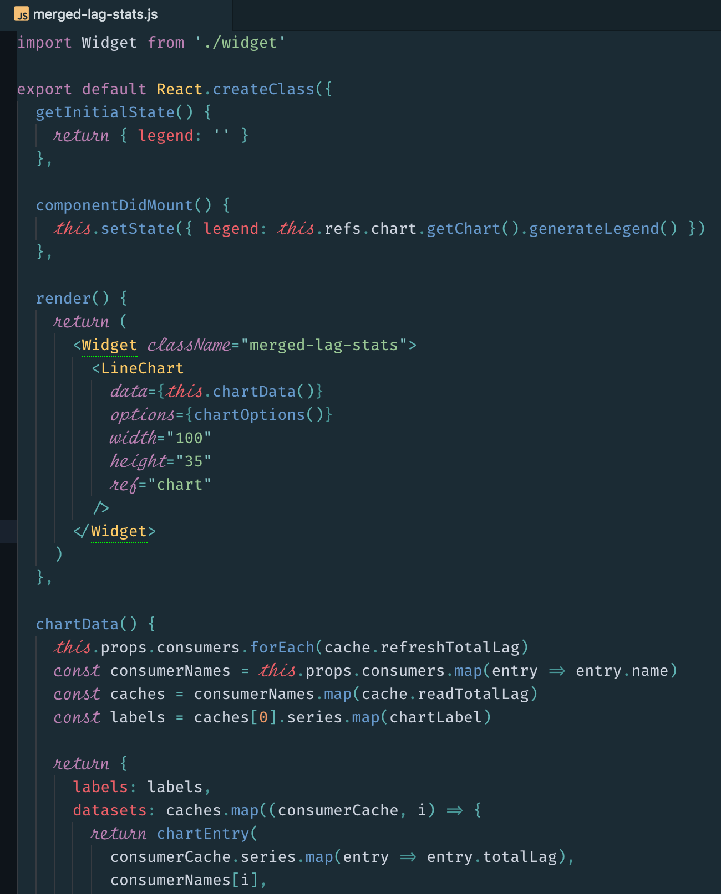

# operator-mono-atom
Free [Operator Mono](http://www.typography.com/blog/introducing-operator) clone for Atom

A stylish way to code!

Check out the [screenshots](#screenshots).

## Installation

1. [Install fonts](#install-fonts)
2. [Configure Atom](#configure-atom)
3. [Troubleshooting](#troubleshooting)
4. [Screenshots](#screenshots)
  1. [JSX](#screenshot-jsx)
  2. [Ruby](#screenshot-ruby)
  3. [Ember](#screenshot-ember)
  4. [Handlebars](#screenshot-handlebars)
  5. [Elixir](#screenshot-elixir)
  6. [Python](#screenshot-python)

### <a name="install-fonts"></a> Install fonts

Download and install [Fira Code](https://github.com/tonsky/FiraCode) font into your system. [Installation instructions](https://github.com/tonsky/FiraCode/wiki)

Download and install [flottflott](http://www.dafont.com/flottflott.font) font into your system in the same manner.

The current version (June 2017) of the fonts can also be found in this repository.

### <a name="configure-atom"></a> Configure Atom

#### Ligatures

To use Fira Code properly you need to enable ligatures. There are two ways to do this, see below:

##### Quick install

Bring up Atom and go to Settings > Themes. Search for [Operator Mono](https://atom.io/themes/operator-mono) and install.

This syntax theme has been built to support this Fira Code, it is built from scratch using the Oceanic Next Italic palette and it will enable ligatures, and make certain attributes italic.

#### Manual install

If you prefer to use your own syntax theme, you have to edit your styles.less and insert these lines:

```
atom-text-editor {
  text-rendering: optimizeLegibility;

  &.editor .syntax--string.syntax--quoted,
  &.editor .syntax--string.syntax--regexp {
    -webkit-font-feature-settings: "liga" off, "calt" off;
  }
}
```

#### Enable flottflott font

In order to enable the flottflott font, you have to manually edit your styles.less file and insert these lines:

```
atom-text-editor.editor {
  /*
    Transform certain attributes into flottflott:
    - this
    - html attributes
  */
  .syntax--variable.syntax--language.syntax--this,
  .syntax--html > .syntax--attribute-name,
  .syntax--JSXAttrs > .syntax--attribute-name {
    // flottflott is italic in itself, don't let atom make it italic
    font-style: normal !important;
    vertical-align: baseline;
    font-family: 'flottflott';
    height: inherit;
    font-size: 145%
    line-height: 100%;
  }
}
```

### <a name="troubleshooting"></a> Troubleshooting

Atom version

The instructions / code works for current version of Atom (1.17.x) but should work for Atom v1.13 and higher if you are locked to a specific version of Atom for some obscure reason. If not, check out the appropriate tag and use that.

Are your ligatures not being applied correctly?

1. In Editor Settings, you might need to enter "Fira Code" in "Font Family"
1. Disable interfering packages that modifies fonts, such as "fonts"


### <a name="screenshots"></a> Screenshots

The screenshots below are taken with theme Oceanic Next Italic.

#### <a name="screenshot-jsx"></a> JSX



#### <a name="screenshot-ruby"></a> Ruby


#### <a name="screenshot-ember"></a> Ember


#### <a name="screenshot-handlebars"></a> Handlebars


#### <a name="screenshot-elixir"></a> Elixir


#### <a name="screenshot-python"></a> Python


